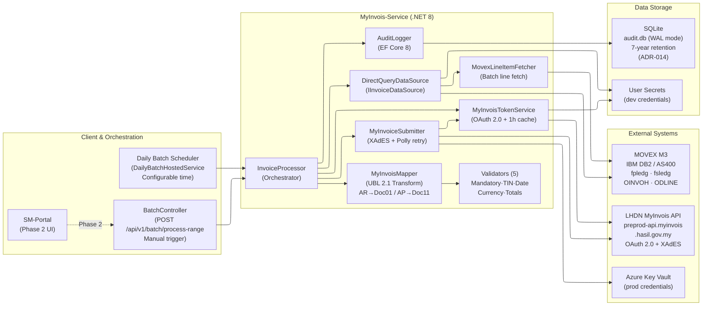

# MyInvois-Service Architecture

**Last Updated:** 2026-05-21
**Status:** Production Ready (Sprint 9)
**Owner:** Hector Salazar (Development & Integration Lead)

## Purpose

This diagram shows the high-level architecture of MyInvois-Service, including:
- Service components and their responsibilities
- Integration with MOVEX (M3) system via IBM DB2/AS400 direct access (ADR-013)
- Integration with MyInvois LHDN government platform
- SQLite audit logging (ADR-014)
- Data flow between systems

## Architecture Diagram

## Component Descriptions

### Client & Orchestration Layer

- **DailyBatchHostedService**: .NET BackgroundService. Fires `ProcessDateRangeBatch` at the configured hour/minute. Controlled by `BatchScheduler:Enabled` (in `src/MyInvois.Api/appsettings.json`). Setting `Enabled: false` skips all scheduled runs; manual trigger still works.
- **BatchController**: ASP.NET Core controller at `POST /api/v1/batch/process-range`. Protected by API Key. Used for UAT testing and on-demand reruns.
- **SM-Portal**: (Phase 2) SM-Portal integration to trigger and monitor submissions from the web UI.

### MyInvois-Service (Core Business Logic)

- **InvoiceProcessor**: Orchestrates the full pipeline for a date range: fetch → transform → validate → submit → audit. Returns `BatchResult { TotalInvoices, SuccessCount, FailedCount, SkippedCount }`.
- **DirectQueryDataSource**: Fetches invoice headers via ODBC+Dapper. AR join path: `FSLEDG → OINVOH (ESVONO=UHVONO) → ODLINE (UHIVNO=UBIVNO)` (ADR-016). AP: direct `fpledg` query. Schema selected per `ActiveCompanyCodes` (mvxcdta=CMP100, mvxc300=CMP300).
- **MovexLineItemFetcher**: Batch-fetches all `ODLINE` records for a voucher set. Called from `DirectQueryDataSource` to avoid N+1 line queries.
- **MyInvoisMapper**: Transforms `MovexInvoice` → `MyInvoiceDocument`. AR invoices (`InvoiceType = "Sales"`) → `DocumentTypeCode = "01"` with our company as Supplier. AP invoices (`InvoiceType = "Purchase"`) → `DocumentTypeCode = "11"` (self-billed) with external vendor as Supplier and our company as Buyer.
- **Validators (5)**: `MandatoryFieldsValidator`, `TINValidator`, `DateValidator`, `CurrencyValidator`, `TotalsValidator`. All non-fail-fast — collect all errors before returning.
- **MyInvoisTokenService**: Isolated OAuth token service. Manages client credentials flow, caches token for 1 hour (SemaphoreSlim-protected refresh). Endpoint: `preprod-api.myinvois.hasil.gov.my/connect/token`.
- **MyInvoiceSubmitter**: Signs invoices (XAdES v1.1, custom — not LHDN SDK), applies `DecimalNormalizer` to match LHDN's re-serialization, submits to `/api/v1.0/documentsubmissions`. Polly retry: 3 attempts, 5s × 2^attempt backoff. Reads UUID from `acceptedDocuments[0].uuid`. Injectable `retrySleepProvider` for test speed.
- **AuditLogger**: Writes `SubmissionResult` records to SQLite (`audit.db`) via EF Core 8 with WAL mode. Supports duplicate detection and failed-submission query.

### External Systems

- **MOVEX M3**: Source of truth for invoice data. IBM DB2 on AS400 (IBM i 7.4). Read-only access. CONO=100 = Production, CONO=300 = Development/UAT.
- **LHDN MyInvois API**: Tax authority submission endpoint. Single host (`preprod-api.myinvois.hasil.gov.my`) for both OAuth tokens and document submission. Rate limits: 300 req/min (submission), 600 req/min (status). Step 08 async validation runs 2–5 min after HTTP 200.
- **Azure Key Vault**: Production credential store for OAuth credentials and API keys. Dev uses `dotnet user-secrets`.

### Data Storage

- **SQLite (audit.db)**: Immutable audit log via EF Core 8, WAL mode, 7-year retention (ADR-014). Replaces SQL Server — lightweight, no server dependency, suitable for single-instance deployment.
- **User Secrets**: Dev/UAT credentials (ClientId, ClientSecret, TIN, connection strings). Never committed to source control.

---

## Key Design Decisions

### Why DB2 Direct Access (Not M3 REST API)?
✅ M3 MI transaction API does not expose all required invoice fields (ADR-013)
✅ Direct ODBC access provides full control over join strategy
✅ No additional middleware layer; lower latency

### Why SQLite (Not SQL Server) for Audit?
✅ Single-instance deployment on SRXWEBAPP1 (ADR-014)
✅ Eliminates SQL Server licence dependency for this service
✅ WAL mode handles concurrent reads safely
✅ 7-year retention achievable with standard SQLite tooling

### Why Daily Batch (Not Real-Time)?
✅ Finance operations are month-end focused
✅ ~600-1100 invoices/month doesn't justify real-time complexity
✅ Daily batch allows controlled retry window

### Why Custom XAdES (Not LHDN SDK)?
✅ LHDN SDK targets a different runtime profile
✅ Custom implementation gives full control over digest/signature ordering
✅ All four signature bugs resolved (2026-05-13); production-ready

### Why Separate MyInvoisTokenService?
✅ Isolates OAuth concerns from submission logic
✅ Independently testable (single responsibility)
✅ Reusable if SM-Portal adds direct LHDN integration

---

## Data Flow Through Components

1. Scheduler fires (or `BatchController` receives request)
2. `InvoiceProcessor.ProcessDateRangeBatch(from, to)` called
3. `DirectQueryDataSource.GetInvoicesByDateRangeAsync` queries MOVEX DB2
4. `MovexLineItemFetcher` batch-fetches line items
5. For each `MovexInvoice`:
   a. `MyInvoisMapper.Transform(invoice)` → `MyInvoiceDocument` + validation
   b. If validation errors → `AuditLogger.LogSubmissionAsync(Skipped)`
   c. If valid → `MyInvoiceSubmitter.Submit(document)`
   d. Submitter calls `MyInvoisTokenService.GetAccessTokenAsync()`
   e. Submitter signs (XAdES) and POSTs to LHDN
   f. On 200 → read UUID from `acceptedDocuments[0].uuid`
   g. On 429/5xx → Polly retries (up to 3)
   h. `AuditLogger.LogSubmissionAsync(Success/Failed)`
6. Return `BatchResult` summary

---

## Error Handling

### MOVEX DB2 Connection Fails
- ODBC connection timeout: 60s command timeout
- Retry: 3 attempts on transient errors (Polly)
- Batch aborted; audit log entry with error

### Validation Fails
- All 5 validators run (non-fail-fast)
- Invoice marked Skipped; errors written to audit log
- Not submitted to LHDN

### MyInvois Submission Fails
- Non-retryable (400, 401, DS101, DS302): Write to audit, mark Failed
- Retryable (429, 500, 503): Polly retries 3 times with exponential backoff
- After 3 retries: mark Failed; eligible for rerun via BatchController

### SQLite Unavailable
- `AuditLogger` throws; `InvoiceProcessor` catches and logs to Serilog
- Submission may succeed but audit record lost — alert condition

---

## Scalability Considerations

### Current Scale (Sprint 9)
- ~100 AR + 500-1000 AP invoices/month
- Single-instance on SRXWEBAPP1
- Sequential submission (Polly-managed rate limiting)
- SQLite audit sufficient for single-instance

### Future Scale (Phase 2+)
- SM-Portal integration for real-time submission monitoring
- Azure Key Vault for credential management
- Application Insights distributed tracing
- If volume grows 10x: migrate audit to SQL Server (interface unchanged)

---

## Related Diagrams

- [data-flow.md](data-flow.md) — Detailed data movement through system
- [integration-sequence.md](integration-sequence.md) — Batch processing sequence
- [auth-flow.md](auth-flow.md) — OAuth 2.0 + XAdES signing details
