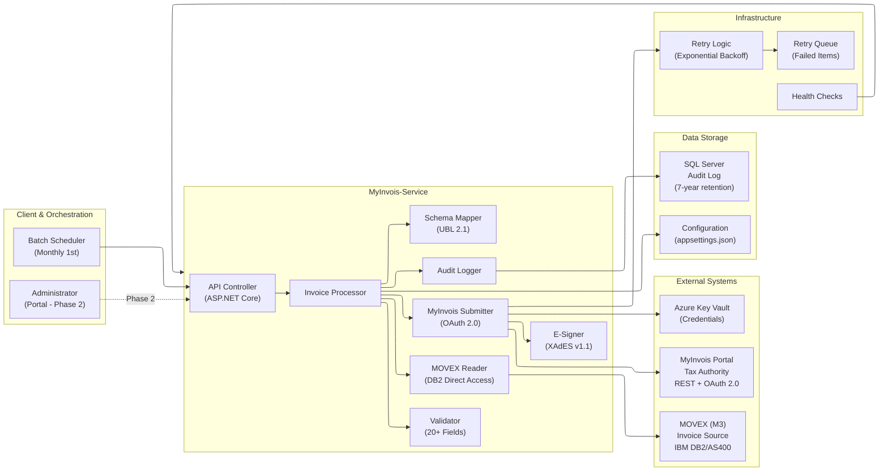

# MyInvois-Service Architecture

**Last Updated:** February 18, 2026 (Updated with implementation status)
**Status:** Production  
**Owner:** Solution Architect

## Purpose

This diagram shows the high-level architecture of MyInvois-Service, including:
- Service components and their responsibilities
- Integration with MOVEX (M3) system via IBM DB2/AS400 direct access (ADR-013)
- Integration with MyInvois government system
- SQL Server audit logging
- Data flow between systems

## Architecture Diagram

## Component Descriptions

### Client & Orchestration Layer
- **Batch Scheduler**: Triggers monthly batch processing on 1st of month (Windows Task Scheduler)
- **Administrator Portal**: (Phase 2) Web UI for monitoring, error recovery, submission status

### MyInvois-Service (Core Business Logic)
- **API Controller**: ASP.NET Core controller exposing batch processing endpoint
- **Invoice Processor**: Orchestrates the entire pipeline (read → validate → map → submit); 60% implemented
- **MOVEX Reader**: ✅ Implemented (80%): Retrieves invoices from M3/MOVEX via direct DB2/AS400 queries (ADR-013); uses DataAccess strategy pattern (DirectQuery/StoredProcedure); tables: fpledg, fsledg, fgledg on schemas mvxcdta/mvxc300; 30s command timeout; NuGet: Net.IBM.Data.Db2, Dapper
- **Schema Mapper**: In Progress (75%): Transforms MOVEX invoice format to UBL 2.1 (MyInvois requirement)
- **Validators**: In Progress (70%): 5 validator classes (MandatoryFields, TIN, Date, Currency, Totals); validates 20+ mandatory MyInvois fields; collects all errors (not fail-fast)
- **MyInvois Submitter**: ✅ Implemented (95%): Submits validated invoices to MyInvois API; manages OAuth tokens (1-hour cache); XAdES v1.1 signing; exponential backoff retry policy; rate limiting (100 req/min)
- **E-Signer**: Uses official MyInvois SDK to create XAdES v1.1 digital signatures (integrated in MyInvois Submitter)
- **Audit Logger**: Interface defined; Database writes for all submission attempts to SQL Server audit log (Week 2 implementation)

### External Systems
- **MOVEX (M3)**: Source of invoice data; IBM DB2/AS400 direct access; command timeout: 30 seconds; NuGet: Net.IBM.Data.Db2, Dapper
- **MyInvois Portal**: Tax authority submission endpoint; rate limit: 100 req/min; OAuth 2.0
- **Azure Key Vault**: Stores OAuth credentials, e-signature keys; never in source code

### Data Storage
- **SQL Server Audit Database**: Immutable audit log of all submissions (7-year retention)
- **Configuration**: appsettings.json stores connection strings, timeout values, feature flags

### Infrastructure
- **Retry Logic**: Exponential backoff (5s, 10s, 20s, 40s max)
- **Retry Queue**: Failed items queued for manual retry; prevents duplicate submission
- **Health Checks**: Monitor dependencies (MOVEX, MyInvois, Database)

---

## Key Design Decisions

### Why Batch (Not Real-Time)?
✅ Finance operations are monthly-based (month-end close)  
✅ Volume (600-1,100/month) doesn't justify real-time complexity  
✅ Easier to control, test, and audit

### Why Queue-Based Retry?
✅ Handles transient failures gracefully  
✅ Allows manual intervention before retry  
✅ Reduces duplicate submissions  
✅ Enables audit trail of all retry attempts

### Why OAuth 2.0?
✅ MyInvois SDK requires it  
✅ More secure than Basic Auth  
✅ Token caching reduces authentication overhead

### Why SQL Server (Not Files)?
✅ Workspace standard (WORKSPACE_RULES.md)  
✅ Better query performance for compliance reports  
✅ Supports 7-year retention with proper indexing

---

## Data Flow Through Components

1. **Scheduler triggers** → Calls API Controller
2. **Controller** → Calls Invoice Processor
3. **Processor** → Reads invoices from MOVEX (Reader)
4. **Reader returns** → Invoice data in MOVEX format
5. **Processor** → Validates invoices (Validator)
6. **Processor** → Maps to UBL 2.1 format (Mapper)
7. **Processor** → Signs invoices (Signer uses Key Vault)
8. **Processor** → Submits to MyInvois (Submitter)
9. **Submitter** → Handles OAuth tokens (Key Vault)
10. **Submitter** → On success: Write to audit log (Logger)
11. **Submitter** → On failure: Queue for retry + Alert

---

## Error Handling

### MOVEX DB2 Connection Fails
- Retry: 3 attempts, 5-second delays on transient DB2 failures
- Alert: Operations Manager
- Fallback: Manual CSV import (emergency)

### Validation Fails
- Collect all errors (don't fail-fast)
- Write error report to audit log
- Email error report to finance team
- Item marked as "Validation Failed" (not submitted)

### MyInvois Submission Fails
- Non-retryable (400, 401, 404): Write to audit, alert finance
- Retryable (408, 500, 503): Queue for retry with exponential backoff
- Rate-limit (429): Throttle subsequent requests; retry after backoff

### Database Unavailable
- Fallback: Log to file temporarily
- Alert: Database Admin
- Retry: Connection retry logic with 30s timeout

---

## Scalability Considerations

### Current Scale (600-1,100 invoices/month)
- Single-instance service
- Batch processes in ~30 minutes
- Sequential submission (600ms per invoice)
- SQL Server auditing sufficient

### Future Scale (Multi-plant, 10K+ invoices/month)
- Phase 4: Parallel submission strategy
- Phase 4: Tenant-based isolation
- Phase 4: Database partitioning by plant
- Phase 4: Batch job optimization

---

## Related Diagrams
- [data-flow.md](data-flow.md) - Detailed data movement through system
- [integration-sequence.md](integration-sequence.md) - Batch processing timeline
- [auth-flow.md](auth-flow.md) - OAuth 2.0 authentication details
- [workflow-process.md](workflow-process.md) - Finance team workflow
- [deployment-topology.md](deployment-topology.md) - Infrastructure layout
