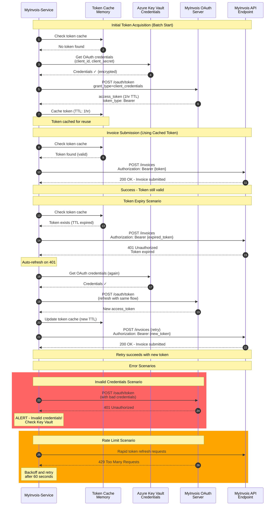

# OAuth 2.0 Authentication Flow - MyInvois

**Last Updated:** February 18, 2026 (Updated with implementation progress)
**Status:** Production  
**Implementation Status:** OAuth token caching fully implemented in MyInvois Submitter
**Owner:** Security Officer

## Purpose

This diagram shows the OAuth 2.0 authentication flow between MyInvois-Service and MyInvois Portal, including:
- Token acquisition and refresh
- Token caching strategy
- Session management
- Credential storage in Azure Key Vault
- Token expiry and re-authentication

## Authentication Flow Diagram



## Authentication Sequence Details

### Phase 1: Token Acquisition (Batch Start)
1. **Check cache**: Is there a valid token already in memory?
2. **If no token**: Retrieve credentials from Azure Key Vault
3. **Request token**: POST to MyInvois OAuth endpoint with client credentials
4. **Store token**: Cache in memory with 1-hour TTL (expires 5 min before actual expiry)
5. **Ready to submit**: Use token for all subsequent API calls

### Phase 2: Token Use (During Submission)
1. **Check cache**: Token still valid?
2. **Include token**: Add `Authorization: Bearer {token}` header
3. **Submit invoice**: POST to MyInvois API
4. **Success**: Continue with next invoice

### Phase 3: Token Refresh (On Expiry)
1. **Detect expiry**: Receive 401 Unauthorized from API
2. **Refresh**: Automatically request new token from OAuth server
3. **Cache new token**: Replace old token in memory
4. **Retry**: Resubmit the invoice with new token
5. **Continue**: Process remaining invoices

---

## Token Management Strategy

### Token Caching
- **Duration**: 1 hour (MyInvois default)
- **Storage**: In-memory cache (not persisted)
- **Key**: Service account identifier
- **Automatic Expiry**: 5 minutes before actual expiry (safety margin)

### Token Refresh
- **Trigger**: 401 Unauthorized response from API
- **Action**: Automatic refresh (no user intervention)
- **Retry**: Immediately retry failed request with new token
- **Logging**: All refreshes logged to audit trail

### Token Revocation
- **When**: Credential rotation, security incident, key compromise
- **Action**: Invalidate cached token; force new authentication
- **Logging**: Revocation event logged with reason

---

## Security Measures

### Credential Storage
- ✅ **Never in source code**: Use Azure Key Vault
- ✅ **Encrypted in transit**: TLS 1.2+
- ✅ **Encrypted at rest**: Key Vault encryption
- ✅ **Access logged**: All credential access audited
- ✅ **Rotation**: Annual key rotation (scheduled)

### Token Security
- ✅ **Short-lived tokens**: 1-hour TTL (not indefinite)
- ✅ **Bearer token**: Requires HTTPS (never HTTP)
- ✅ **No token logging**: Tokens never written to logs or audit trail
- ✅ **Memory-only cache**: Not persisted to disk

### Validation
- ✅ **OAuth signature verification**: Validate token before use
- ✅ **HTTPS only**: Reject http:// URLs
- ✅ **Certificate pinning**: (Future enhancement)

---

## Error Handling

### Invalid Credentials (401 from OAuth)
- **Action**: Stop batch, alert Security Officer
- **Root cause**: Credentials in Key Vault invalid/rotated
- **Recovery**: Verify and update credentials in Key Vault
- **Impact**: Cannot proceed; manual intervention required

### Token Expired (401 from API)
- **Action**: Automatic refresh (retry logic)
- **Root cause**: Token lived longer than cached TTL
- **Recovery**: Automatic token refresh and retry
- **Impact**: Transparent to user (automatic handling)

### Rate Limit (429 from OAuth)
- **Action**: Exponential backoff; retry after delay
- **Root cause**: Too many token refresh requests
- **Recovery**: Wait 60 seconds; retry
- **Impact**: Batch may be delayed

### Network Error (Connection timeout)
- **Action**: Retry with exponential backoff
- **Root cause**: Network unavailable, OAuth server unreachable
- **Recovery**: Automatic retry (3 attempts, 5s delays)
- **Impact**: May fail if OAuth unavailable for extended period

---

## Configuration

### Application Settings
```json
{
  "MyInvoisApiSettings": {
    "OAuthUrl": "https://myinvois.api/oauth",
    "ApiUrl": "https://myinvois.api/v1",
    "ClientId": "***from Key Vault***",
    "ClientSecret": "***from Key Vault***",
    "TokenCacheTTLMinutes": 55,  // Refresh 5 min before expiry
    "RequestTimeoutSeconds": 30
  }
}
```

### Azure Key Vault Secrets
```
MyInvoisApiSettings--ClientId       = "xxxxx"
MyInvoisApiSettings--ClientSecret   = "yyyyy"
SigningKeyPath                      = "/path/to/key"
```

---

## Related Diagrams
- [architecture.md](architecture.md) - System components
- [data-flow.md](data-flow.md) - Data movement through system
- [integration-sequence.md](integration-sequence.md) - Batch processing timeline
