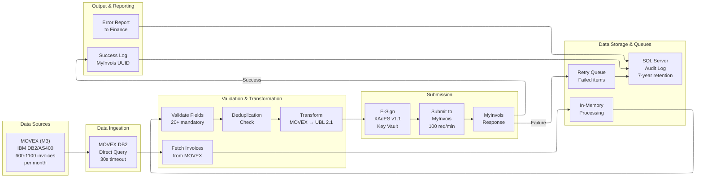
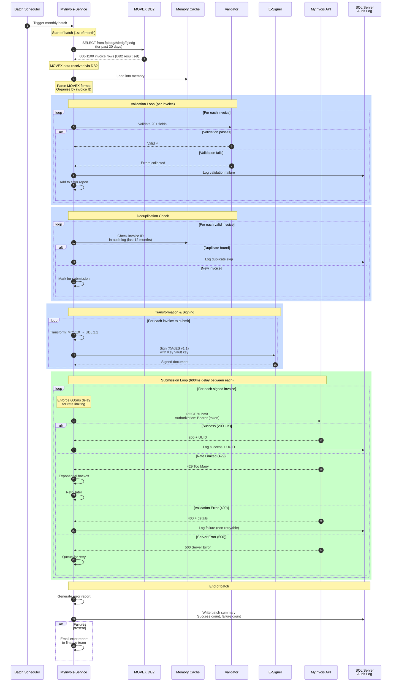

# Data Flow - Invoice Processing Pipeline

**Last Updated:** February 18, 2026 (Updated with implementation progress)
**Status:** Production  
**Owner:** Solution Architect

## Purpose

This diagram shows how invoice data flows through MyInvois-Service from MOVEX to MyInvois, including:
- Data ingestion from MOVEX/M3 via IBM DB2/AS400 direct access (ADR-013)
- Validation and transformation
- Submission to MyInvois
- Audit logging
- Error handling and retry queues

## High-Level Data Flow



## Detailed Processing Sequence



## Data Transformation: MOVEX → UBL 2.1

### MOVEX Format (Source — DB2 Tables)

Data sourced from DB2 tables on schemas `mvxcdta`/`mvxc300`:
- `fpledg` — Accounts Payable ledger
- `fsledg` — Accounts Receivable ledger
- `fgledg` — General Ledger

```json
{
  "InvoiceNumber": "INV-2026-001",
  "CustomerName": "ABC Manufacturing",
  "InvoiceDate": "2026-02-05",
  "TotalAmount": 5000.00,
  "Currency": "MYR",
  "Items": [
    {
      "Description": "Widget",
      "Quantity": 100,
      "UnitPrice": 50.00
    }
  ]
}
```

### UBL 2.1 Format (Destination - MyInvois Required)
```xml
<Invoice xmlns="urn:oasis:names:specification:ubl:schema:xsd:Invoice-2">
  <ID>INV-2026-001</ID>
  <IssueDate>2026-02-05</IssueDate>
  <BillingReference>...</BillingReference>
  <InvoiceLine>
    <Item>
      <Description>Widget</Description>
      <Quantity>100</Quantity>
      <UnitPrice>50.00</UnitPrice>
    </Item>
  </InvoiceLine>
  <LegalMonetaryTotal>
    <TaxInclusiveAmount>5000.00</TaxInclusiveAmount>
  </LegalMonetaryTotal>
</Invoice>
```

---

## Validation Rules

### 20+ Mandatory Fields
1. Invoice ID ✓
2. Invoice Date ✓
3. Supplier Tax ID (TIN)
4. Buyer Tax ID (TIN)
5. Invoice Total ✓
6. Tax Amount
7. Line Items (min 1)
8. Currency (MYR for Malaysia)
9. Seller Name
10. Buyer Name
11. Payment Terms
12. Line item descriptions
13. Line item quantities
14. Line item unit prices
15. Line item tax rates
16. Document type code
17. Supplying country
18. Receiving country
19. Issue date format (ISO 8601)
20. Due date (if applicable)
... and more based on MyInvois spec

### Validation Error Collection
- ❌ NOT fail-fast (collect all errors)
- ✅ Report all issues in single error report
- ✅ Allow partial processing (some invoices valid, some not)
- ✅ Finance team can see exactly what's wrong

---

## Retry & Error Handling

### Transient Failures (Retryable)
- **408 Request Timeout** → Retry with exponential backoff
- **500 Internal Server Error** → Retry with exponential backoff
- **503 Service Unavailable** → Retry with exponential backoff
- **Network timeout** → Retry with exponential backoff

### Non-Transient Failures (Don't Retry)
- **400 Bad Request** → Data issue; finance team must fix
- **401 Unauthorized** → Token invalid; auto-refresh and retry
- **404 Not Found** → API endpoint wrong; escalate to IT
- **DS302 Duplicate** → Already submitted; skip

### Retry Strategy
- **1st attempt**: Immediate
- **2nd attempt**: After 5 seconds
- **3rd attempt**: After 10 seconds
- **Max retries**: 3 total
- **Backoff type**: Exponential

---

## Storage Strategy

### In-Memory Cache (During Batch)
- Raw MOVEX invoices: ~600-1100 items (~10 MB)
- Validated invoices: ~500-1000 items (processed)
- Transformation results: ~500-1000 UBL documents
- **Lifetime**: Single batch execution (~30 minutes)
- **Cleared**: After batch completes

### SQL Server Audit Log (Permanent)
- **Every submission attempt** logged: Invoice ID, source, result, timestamp
- **Success entries** include: MyInvois UUID, timestamp
- **Failure entries** include: Error message, timestamp
- **Immutable**: Never deleted (7-year retention)
- **Queryable**: Indexed for fast retrieval

### Retry Queue (Temporary)
- **Failed submissions** queued for retry
- **Manual review** before retry
- **Lifetime**: Until manually retried or manual skip
- **Logged** when moved to retry queue

---

## Performance Metrics

### Processing Time
- **Data fetch**: ~5 seconds (600-1100 invoices from MOVEX DB2)
- **Validation**: ~2-3 minutes (600+ validations)
- **Transformation**: ~1-2 minutes (600+ UBL conversions)
- **Signing**: ~2-3 minutes (600+ XAdES signatures)
- **Submission**: ~15-20 minutes (600+ @ 600ms each)
- **Total batch time**: ~25-30 minutes

### Throughput
- **MOVEX DB2 read rate**: 600-1100 per batch (monthly)
- **Submission rate**: 100 per minute (rate-limited by MyInvois)
- **Actual submission rate**: 99 per minute (600ms delay)

---

## Related Diagrams
- [architecture.md](architecture.md) - System components
- [integration-sequence.md](integration-sequence.md) - Batch timeline
- [auth-flow.md](auth-flow.md) - OAuth token management
