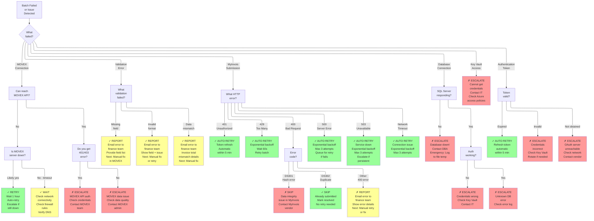

# Decision Tree - Troubleshooting & Operational Decisions

**Last Updated:** February 5, 2026  
**Status:** Production  
**Owner:** Operations Manager

## Purpose

This diagram provides a decision framework for:
- Troubleshooting common issues
- Determining whether to retry or escalate
- Deciding when manual intervention is needed
- Escalation paths for different failure types

## Troubleshooting Decision Tree



## Action Guide by Decision Color

### 🟢 GREEN (AUTO RETRY / AUTO RECOVER)
**Action**: System handles automatically; no manual intervention needed
- **Auto-Retry**: Exponential backoff (3-5 attempts)
- **Monitoring**: Monitor logs; alert if not resolved
- **Escalation**: Only if still failing after auto-retries
- **Examples**: 
  - 401 Unauthorized (auto token refresh)
  - 429 Rate Limited (auto backoff)
  - 500 Server Error (auto retry)

**Next Steps**:
1. ✓ Let system retry automatically
2. Monitor logs for 10-30 minutes
3. If still failing → Check related YELLOW items
4. If critical → Escalate per RED path

---

### 🟡 YELLOW (REPORT / MANUAL ACTION REQUIRED)
**Action**: Issue requires manual intervention; not critical but blocking
- **Report**: Send detailed error report to responsible team
- **Investigation**: Root cause analysis needed
- **Timeline**: 1-24 hours to resolution
- **Examples**: 
  - Validation errors (missing fields)
  - Data quality issues
  - Format mismatches

**Next Steps**:
1. Email detailed error report to responsible party
2. Include: What failed, which invoices, actionable next steps
3. Specify required action (fix data, retry, escalate)
4. Set follow-up check: When is retry expected?
5. Track resolution status

---

### 🔴 RED (ESCALATE / CRITICAL)
**Action**: Critical issue; immediate escalation required
- **Escalate**: Alert senior staff (IT Manager, Finance Manager)
- **Timeline**: Immediate attention required
- **Impact**: Batch may be blocked
- **Examples**:
  - Database unavailable
  - Key Vault inaccessible
  - Authentication credentials invalid
  - MOVEX API inaccessible

**Next Steps**:
1. Send URGENT alert email
2. Include: What failed, when, potential impact
3. Call on-call manager (if outside business hours)
4. Conference with relevant teams (IT, Finance)
5. Determine: Can batch retry, or manual escalation?

---

## Escalation Paths

### Escalation Level 1: Finance Manager
**When**: Validation errors, data quality issues
**Contact**: finance-manager@company.com
**Actions**:
- Review error report
- Coordinate with MOVEX admin
- Request data fix
- Authorize manual retry
- Track resolution

**SLA**: Within 2 business hours

### Escalation Level 2: IT Manager
**When**: Service/Integration/Database issues
**Contact**: it-manager@company.com
**Actions**:
- Investigate system issue
- Check logs and monitoring
- Contact external vendors (MOVEX, MyInvois)
- Authorize retry or rollback
- Post-mortem after resolution

**SLA**: Immediate (during business hours)

### Escalation Level 3: Security Officer
**When**: Authentication, credential, or security issues
**Contact**: security-officer@company.com
**Actions**:
- Verify credential validity
- Check Azure Key Vault access
- Review security logs
- Authorize key rotation
- Investigate compliance impact

**SLA**: Immediate (critical)

### Escalation Level 4: Database Administrator
**When**: SQL Server issues
**Contact**: dba@company.com
**Actions**:
- Restore from backup
- Investigate corruption
- Verify encryption status
- Check backup integrity
- Coordinate with IT Manager

**SLA**: Within 30 minutes

---

## Common Issues & Quick Fixes

### Issue: Batch Fails at MOVEX Connection
**Symptom**: "Connection timeout" or "Service unavailable"
**Quick Fix**:
1. Check: Is MOVEX server down? (Check status page)
2. Check: Is network accessible? (ping MOVEX server)
3. Check: Firewall rules? (Verify port 443 allowed)
4. Action: Wait 1 hour; system will auto-retry
5. If still failing after 3 auto-retries → Escalate to IT Manager

**Prevention**: Monitor MOVEX status page; schedule batch after maintenance

---

### Issue: Validation Errors (Missing Fields)
**Symptom**: Email report: "15 invoices failed: Missing TaxId"
**Quick Fix**:
1. Review: Which invoices? (Listed in error report)
2. Contact: MOVEX admin team
3. Request: Add missing field values in M3
4. Wait: For data fix (usually 1-2 hours)
5. Action: Trigger batch retry on 2nd or 3rd of month
6. Verify: Check batch results again

**Prevention**: Finance team QA invoices before batch (27th-31st)

---

### Issue: MyInvois Returns DS302 (Duplicate)
**Symptom**: Batch report: "Invoice DS302 - Already submitted"
**Quick Fix**:
1. Check: View audit log for previous submission
2. Verify: Is duplicate legitimate or error?
3. Action: If duplicate → Mark as "Skip" (no retry)
4. Action: If error → Investigate (contact MyInvois)
5. Don't Retry: DS302 means already in system

**Prevention**: Check duplicate detection before retry

---

### Issue: Rate Limit (429 Too Many Requests)
**Symptom**: Batch slows down; takes 45+ minutes
**Quick Fix**:
1. System handles: Auto-backoff + retry
2. No action: Batch will complete (slower)
3. Monitor: Check batch logs
4. Don't: Manually retry (will hit limit again)
5. Prevention: Confirm 600ms delay in configuration

**Prevention**: Verify rate limiting in code (600ms per submission)

---

### Issue: Authentication Token Expires
**Symptom**: Error "401 Unauthorized" mid-batch
**Quick Fix**:
1. System handles: Auto-refresh token
2. System retries: Failed submission automatically
3. Monitor: Check batch logs
4. No action: Transparent to operator
5. If failing: Check Key Vault credentials

**Prevention**: Verify token TTL = 1 hour; auto-refresh on 401

---

## When to Stop & Escalate

### STOP and ESCALATE When:
1. ❌ **Same issue fails 3+ times** → System can't auto-recover
2. ❌ **Critical system unavailable** (Database, Key Vault) → Can't proceed
3. ❌ **Security issue detected** (Invalid credentials, access denied) → Stop immediately
4. ❌ **Compliance violation risk** (Data loss, audit trail broken) → Escalate immediately
5. ❌ **Unknown error** (Not in decision tree) → Need expert review

### Decision Framework:
```
Can system auto-retry? 
  YES → Let it retry (monitor logs)
  NO → Is this a data issue?
    YES → Report to Finance Manager
    NO → Is this a system issue?
      YES → Escalate to IT Manager
      NO → Is this a security issue?
        YES → Escalate to Security Officer
        NO → Escalate to Architecture Team
```

---

## Related Diagrams
- [integration-sequence.md](integration-sequence.md) - Batch execution flow
- [workflow-process.md](workflow-process.md) - Finance team workflow
- [architecture.md](architecture.md) - System components
