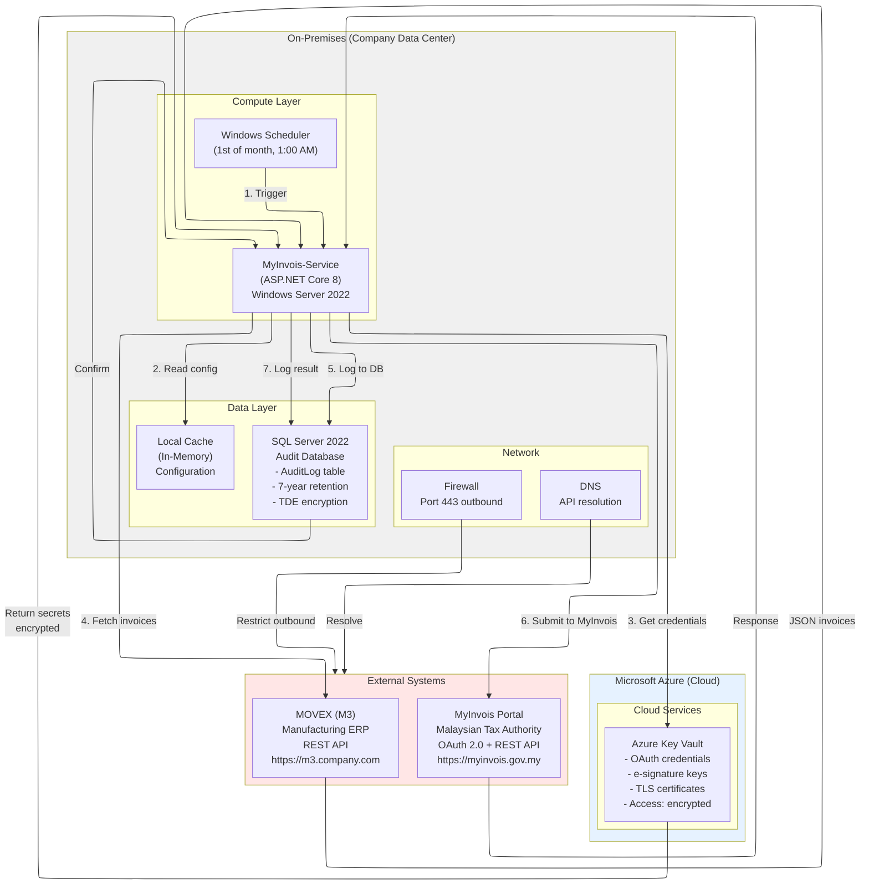
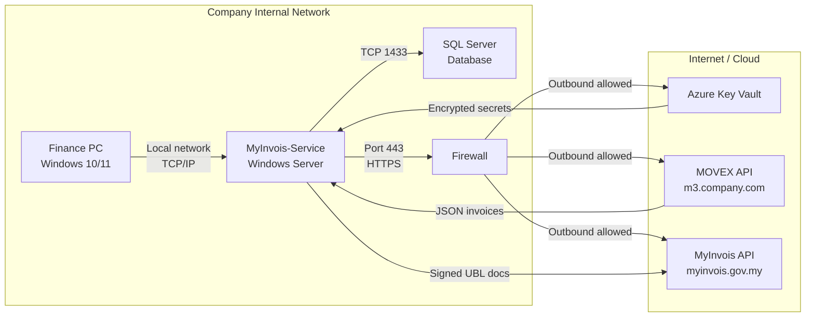
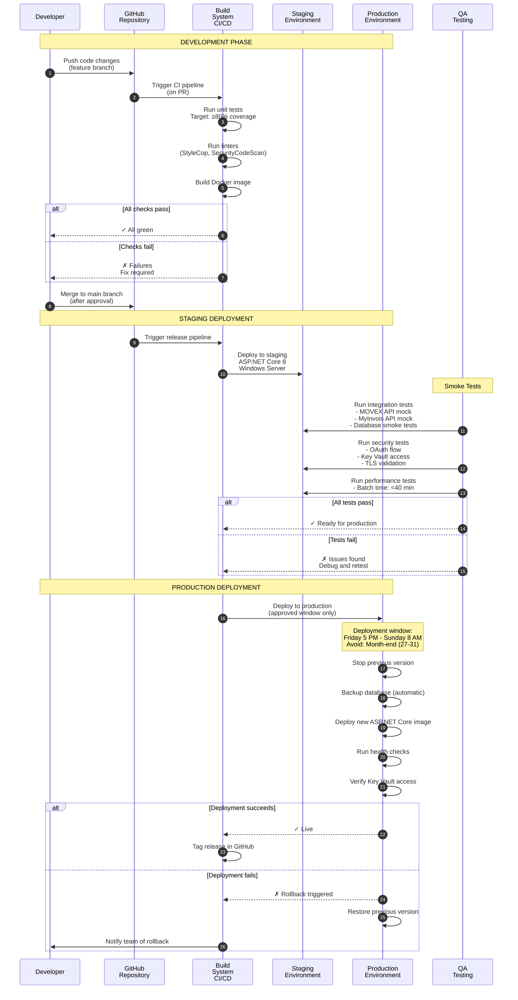

# Deployment Topology - Infrastructure & Deployment

**Last Updated:** February 5, 2026  
**Status:** Production  
**Owner:** DevOps / IT Manager

## Purpose

This diagram shows the physical and logical deployment topology, including:
- On-premises vs. cloud infrastructure
- Network architecture
- Database topology
- Credential management
- Deployment process and environments

## Current Deployment Topology (Phase 1)



## Network Architecture



## Deployment Process



## Database Topology

### SQL Server Schema

```
Database: MyInvoisAudit
├── [dbo].[AuditLog] (Main audit table)
│   ├── AuditId (PK, GUID)
│   ├── Timestamp (DateTime2, UTC)
│   ├── UserId (Service account)
│   ├── Action (e.g., "MyInvois_Submit")
│   ├── ResourceType (Invoice)
│   ├── ResourceId (Invoice ID)
│   ├── Status (Success/Failed)
│   ├── MyInvoisUUID (From response)
│   ├── ErrorMessage (If failed)
│   ├── RequestPayload (Signed UBL)
│   └── ResponsePayload (MyInvois response)
│
├── Indexes
│   ├── IX_AuditLog_Timestamp (Clustered)
│   ├── IX_AuditLog_Status (Non-clustered)
│   ├── IX_AuditLog_MyInvoisUUID (Non-clustered)
│   └── IX_AuditLog_Resource (Non-clustered)
│
└── Views
    ├── vw_MonthlySubmissions (Summary by month)
    ├── vw_FailedSubmissions (Only failures)
    └── vw_AuditTrail (Formatted for compliance)
```

### Encryption & Security
- **Encryption at Rest**: TDE (Transparent Data Encryption) enabled
- **Encryption in Transit**: TLS 1.2+ for all connections
- **Backup Encryption**: Encrypted backups to network storage
- **Access Control**: 
  - Service account (read/write)
  - Database admin (backup/restore)
  - Auditor (read-only)

### Backup & Recovery
- **Frequency**: Daily automated backups (11 PM)
- **Retention**: 30 days (on-premises), 7 years (archive)
- **Recovery SLA**: RTO 4 hours, RPO 24 hours
- **Testing**: Quarterly restoration tests

---

## Azure Key Vault Configuration

```
Resource Group: myinvois-rg
Key Vault: myinvois-keyvault-prod

Secrets:
├── MyInvoisApiSettings--ClientId
├── MyInvoisApiSettings--ClientSecret
├── MyInvoisSigningKey (PEM format)
├── MyInvoisSigningCert (X.509)
├── MovexApiToken (if applicable)
└── SqlServer--ConnectionString

Access Policies:
├── Service account: Get, List
├── IT Manager: Get, List, Set, Delete
└── Automation: Get (read-only)
```

---

## Environments

### Development Environment
- **Location**: Developer machine
- **Configuration**: appsettings.Development.json
- **Database**: LocalDB or staging SQL Server
- **External APIs**: Mock servers
- **Logging**: Console + file
- **Authentication**: User Secrets (local key management)

### Staging Environment
- **Location**: On-premises staging server
- **Configuration**: appsettings.Staging.json
- **Database**: Staging SQL Server (copy of prod)
- **External APIs**: Mock servers
- **Logging**: File + Event Log
- **Authentication**: Azure Key Vault (same as prod)
- **Purpose**: Final testing before production deployment

### Production Environment
- **Location**: On-premises production server
- **Configuration**: appsettings.json
- **Database**: Production SQL Server
- **External APIs**: Real MOVEX + MyInvois endpoints
- **Logging**: SQL Server audit log
- **Authentication**: Azure Key Vault
- **Purpose**: Live monthly batch processing

---

## Future Deployment Topology (Phase 3 - Cloud)

```
Target: Azure App Service + Azure SQL Database

Current: On-Premises
├── Windows Server + .NET Service
├── SQL Server (on-premises)
└── Manual credential management

Future: Azure Cloud
├── App Service (PaaS)
├── Azure SQL Database (Managed)
├── Azure Key Vault (Managed credentials)
├── Application Insights (Monitoring)
├── Azure Storage (Backups/Archive)
└── Auto-scaling (if needed)

Benefits:
✓ Reduced infrastructure overhead
✓ Automatic backups & geo-replication
✓ Global availability
✓ Pay-per-use cost model
✓ Easier disaster recovery
```

---

## Monitoring & Health Checks

### Service Health Checks
- **Startup**: Verify Key Vault access
- **Startup**: Verify SQL Server connection
- **Periodic**: Check external API availability (MOVEX, MyInvois)
- **Continuous**: Monitor error logs for critical issues

### Alerting
- **Alert 1**: Service fails to start → Email IT Manager
- **Alert 2**: Batch fails to complete → Email Finance Manager
- **Alert 3**: Database full → Email DBA
- **Alert 4**: MyInvois API unreachable → Email IT Manager

---

## Disaster Recovery Plan

### Recovery Objectives
- **RTO** (Recovery Time Objective): 4 hours
- **RPO** (Recovery Point Objective): 24 hours (daily backups)

### Failure Scenarios

| Failure | Recovery Action | Time | Data Loss |
|---------|-----------------|------|-----------|
| Service crashes | Restart service | 5 min | 0 (in-memory data lost, re-process) |
| Database corrupted | Restore from backup | 1 hour | 24 hours |
| Key Vault inaccessible | Manual credential entry (temp) | 30 min | 0 |
| Network outage | Batch reschedule | N/A | 0 |
| Complete data center loss | Fail over to backup DC | 2-4 hours | 24 hours |

### Backup & Recovery Testing
- **Quarterly**: Test database restore from backup
- **Semi-annually**: Test Key Vault recovery procedure
- **Annually**: Full disaster recovery drill

---

## Maintenance & Updates

### Scheduled Maintenance Window
- **Frequency**: First Saturday of month, 8 PM - 10 PM
- **Type**: Patches, updates, housekeeping
- **Notification**: Sent to Finance Manager 1 week prior

### Patch Management
- **Security patches**: Within 48 hours of release
- **Minor updates**: Monthly (first Saturday)
- **Major upgrades**: Quarterly + testing
- **Verification**: Smoke tests after all updates

---

## Related Diagrams
- [architecture.md](architecture.md) - System components
- [auth-flow.md](auth-flow.md) - Credential management
- [data-flow.md](data-flow.md) - Data movement
