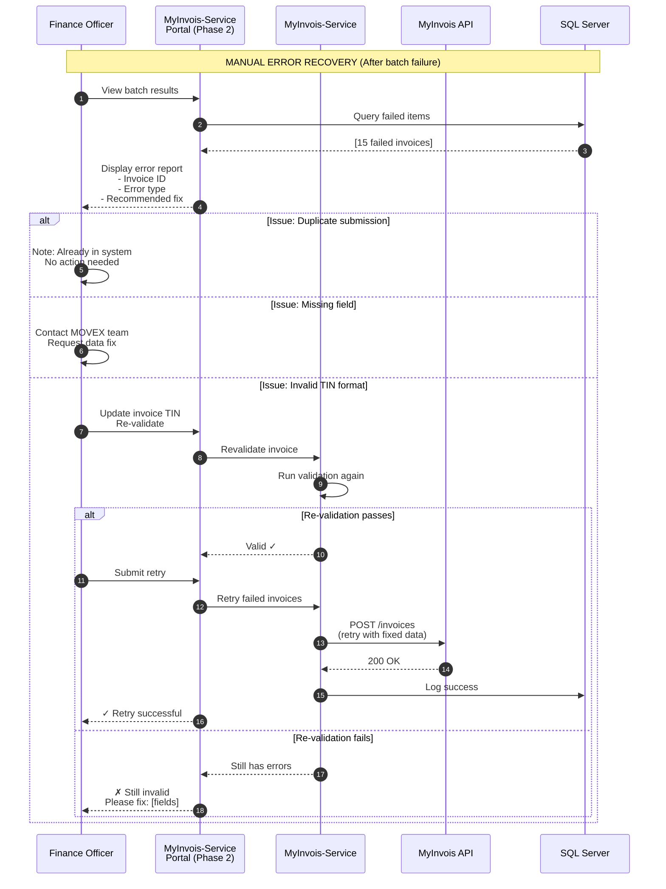

# Integration Sequence - Monthly Batch Processing

**Last Updated:** February 18, 2026 (Updated with implementation progress)
**Status:** Production  
**Owner:** Integration Lead

## Purpose

This diagram shows the complete monthly batch processing sequence, including:
- Batch trigger and initialization
- MOVEX DB2/AS400 database queries (ADR-013)
- Invoice processing pipeline
- MyInvois submission sequence
- Error handling and retries
- Completion and notifications

## Complete Batch Execution Sequence

```mermaid
---
config:
  theme: light
---
sequenceDiagram
  autonumber
  participant Scheduler as Windows<br/>Scheduler
  participant Service as MyInvois-Service<br/>API
  participant MOVEX as MOVEX<br/>M3 System
  participant Validator as Validator
  participant Signer as XAdES Signer
  participant MyInvois as MyInvois<br/>Portal
  participant DB as SQL Server<br/>Audit DB
  participant Finance as Finance<br/>Email
  
  Note over Scheduler,Finance: BATCH INITIALIZATION (1st of month, 1:00 AM)
  
  Scheduler->>Service: POST /batch/process
  activate Service
  Service->>DB: Log batch started<br/>timestamp: 2026-02-01 01:00
  DB-->>Service: Logged ✓
  
  Note over Service,MOVEX: PHASE 1: DATA FETCH (1:00 - 1:05 AM)
  
  Service->>MOVEX: GET /invoices<br/>dateFrom: 2026-01-01<br/>dateTo: 2026-01-31
  activate MOVEX
  Note over MOVEX: Query M3 database<br/>~600-1100 invoices
  MOVEX-->>Service: JSON array (10 MB)<br/>600-1100 invoices
  deactivate MOVEX
  
  Service->>Service: Parse & validate JSON<br/>Load into memory
  Service->>DB: Log: Fetched 850 invoices
  
  Note over Service,Validator: PHASE 2: VALIDATION (1:05 - 1:10 AM)
  
  rect rgb(200, 220, 255)
    Note over Service,Validator: For each of 850 invoices
    loop Validation (2.3s per 100)
      Service->>Validator: Validate invoice<br/>(20+ mandatory fields)
      alt All fields valid
        Validator-->>Service: Valid ✓
        Service->>Service: Add to submission list
      else Missing fields
        Validator-->>Service: Errors: [fields...]
        Service->>Service: Add to error report
        Service->>DB: Log validation error<br/>Invoice ID, missing fields
      else Invalid format
        Validator-->>Service: Errors: [issues...]
        Service->>DB: Log validation error
      end
    end
  end
  
  Service->>Service: Validation summary:<br/>✓ 820 valid<br/>✗ 30 invalid
  Service->>DB: Log validation complete<br/>820 valid, 30 failed
  
  Note over Service,Validator: PHASE 3: DEDUPLICATION (1:10 - 1:11 AM)
  
  Service->>DB: Query audit log<br/>Last 12 months: existing invoices
  DB-->>Service: 8,000 previous submissions
  Service->>Service: Check for duplicates<br/>(invoice ID match)
  Note over Service: Found 5 duplicates<br/>Skip from submission
  Service->>DB: Log duplicates skipped
  Service->>Service: Final submission list:<br/>815 invoices
  
  Note over Service,Signer: PHASE 4: TRANSFORMATION & SIGNING (1:11 - 1:15 AM)
  
  rect rgb(200, 220, 255)
    Note over Service,Signer: For each of 815 invoices
    loop Transform & Sign (2.2s per 100)
      Service->>Service: Transform<br/>MOVEX format → UBL 2.1
      Service->>Signer: Sign with XAdES v1.1<br/>(from Key Vault)
      Signer-->>Service: Signed XML document
      Note over Service: ~2-3 min total
    end
  end
  
  Service->>Service: Signing complete<br/>815 documents ready
  Service->>DB: Log transformation complete
  
  Note over Service,MyInvois: PHASE 5: SUBMISSION (1:15 - 1:35 AM)
  
  rect rgb(200, 255, 200)
    Note over Service,MyInvois: Rate limiting: 600ms between requests<br/>= 100 requests per minute
    loop For each of 815 invoices (submit with 600ms delay)
      Note over Service: 600ms delay<br/>(rate limiting)
      Service->>MyInvois: POST /invoices<br/>Authorization: Bearer {token}<br/>Content: Signed UBL
      alt Success (200 OK)
        MyInvois-->>Service: 200 OK<br/>UUID: 12345<br/>QR Code: [qr]
        Service->>DB: Log success<br/>Invoice ID, MyInvois UUID<br/>timestamp
        Service->>Service: Add to success list
      else Server error (500, 503)
        MyInvois-->>Service: 500 or 503
        Service->>Service: Queue for retry<br/>(max 3 attempts)
        Service->>DB: Log failure<br/>Error code, timestamp
      else Validation error (400)
        MyInvois-->>Service: 400 Bad Request<br/>DS301 (hash error)<br/>Details: [...]
        Service->>DB: Log failure<br/>Non-retryable error
      else Duplicate (already submitted)
        MyInvois-->>Service: DS302<br/>Already in system
        Service->>DB: Log duplicate<br/>Skip (don't retry)
      else Rate limited (429)
        MyInvois-->>Service: 429 Too Many<br/>Backoff: 60s
        Service->>Service: Exponential backoff<br/>Retry after 60s
      else Authentication (401)
        MyInvois-->>Service: 401 Unauthorized<br/>Token expired
        Service->>Service: Auto-refresh token<br/>Retry with new token
      end
    end
  end
  
  Service->>Service: Submission complete<br/>✓ 800 successful<br/>✗ 15 failed<br/>⏳ 0 retrying
  Service->>DB: Log submission phase complete
  
  Note over Service,Finance: PHASE 6: ERROR REPORTING (1:35 - 1:37 AM)
  
  alt Failures present (15 invoices)
    Service->>Service: Generate error report
    Note over Service: CSV: Invoice ID, Error type<br/>HTML: Actionable next steps
    Service->>DB: Log error report generated
    Service->>Finance: Email error report<br/>To: finance-manager@company.com<br/>Subject: MyInvois Batch - 15 Failed
  else All succeeded (unlikely)
    Service->>Finance: Email success notification<br/>800 invoices submitted successfully
  end
  
  Note over Service,Finance: PHASE 7: BATCH COMPLETION (1:37 AM)
  
  Service->>DB: Log batch complete<br/>Duration: 37 minutes<br/>Result: 800 success, 15 failed<br/>Timestamp: 2026-02-01 01:37
  
  deactivate Service
  
  Note over Scheduler,Finance: NEXT RUN: March 1st, 1:00 AM
```

## Error Recovery Sequence (Manual Retry)

---

## Failure Scenarios & Recovery

### Scenario 1: MOVEX Unavailable During Fetch
- **Time**: 1:05 AM
- **Error**: Connection timeout (30s)
- **Recovery**: Retry 3 times (5s delay each)
- **Outcome**: If still failed, batch aborted; alert Operations Manager
- **Next batch**: Try again manually on 2nd of month

### Scenario 2: Validation Error (30% of invoices)
- **Time**: 1:10 AM
- **Error**: Missing mandatory fields in MOVEX data
- **Recovery**: 
  - Log all validation errors (non-blocking)
  - Process valid invoices (820)
  - Generate error report for finance team
- **Outcome**: Batch continues; finance team contacts MOVEX admin
- **Next step**: Manual data fix; manual retry

### Scenario 3: MyInvois Rate Limit (429)
- **Time**: 1:20 AM (during submission)
- **Error**: 429 Too Many Requests (exceeded 100/min)
- **Recovery**: 
  - Exponential backoff (wait 60 seconds)
  - Continue submissions (queue is being processed)
- **Outcome**: Batch slows down; takes 45+ minutes total

### Scenario 4: Authentication Expires Mid-Batch
- **Time**: 1:25 AM (during submission)
- **Error**: 401 Unauthorized (token expired)
- **Recovery**:
  - Automatic token refresh
  - Retry failed submission with new token
- **Outcome**: Transparent; batch continues without manual intervention

### Scenario 5: Database Audit Log Unavailable
- **Time**: Any time during batch
- **Error**: SQL Server connection failed
- **Recovery**:
  - Fallback to file-based logging (temporary)
  - Continue processing
  - Alert Database Admin
- **Outcome**: Submissions continue; manually migrate logs to DB after recovery

---

## Performance Baseline

| Phase | Duration | Invoices | Rate | Notes |
|-------|----------|----------|------|-------|
| Fetch | 5 min | 850 | - | Depends on MOVEX response time |
| Validate | 5 min | 850 | 170/min | Parallel validation possible |
| Deduplicate | 1 min | 850 | - | Database query only |
| Transform | 4 min | 815 | 204/min | XAdES signing is bottleneck |
| Submit | 20 min | 815 | 41/min | Rate-limited to 100/min |
| Report | 2 min | - | - | Generate error report |
| **Total** | **37 min** | **815** | **22/min** | Actual submission rate |

---

## Monitoring & Alerts

### During Batch
- Monitor error logs every 5 minutes
- Alert threshold: >10% failure rate
- Auto-escalate: If any phase takes 2x expected time

### After Batch
- Email summary to Finance Manager (within 1 hour)
- Archive batch logs to audit database
- Generate KPI report (monthly)

### SLA
- **Batch start**: 1st of month, 1:00 AM ±5 min
- **Batch completion**: By 3:00 AM (2-hour window)
- **Error reporting**: Within 30 minutes of completion
- **Finance team response**: By end of business day

---

## Related Diagrams
- [architecture.md](architecture.md) - System components
- [data-flow.md](data-flow.md) - Detailed data transformation
- [auth-flow.md](auth-flow.md) - OAuth token management during batch
