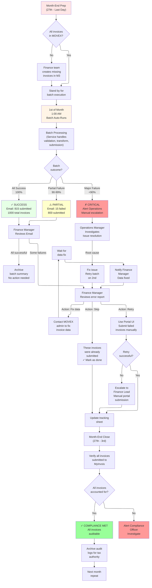
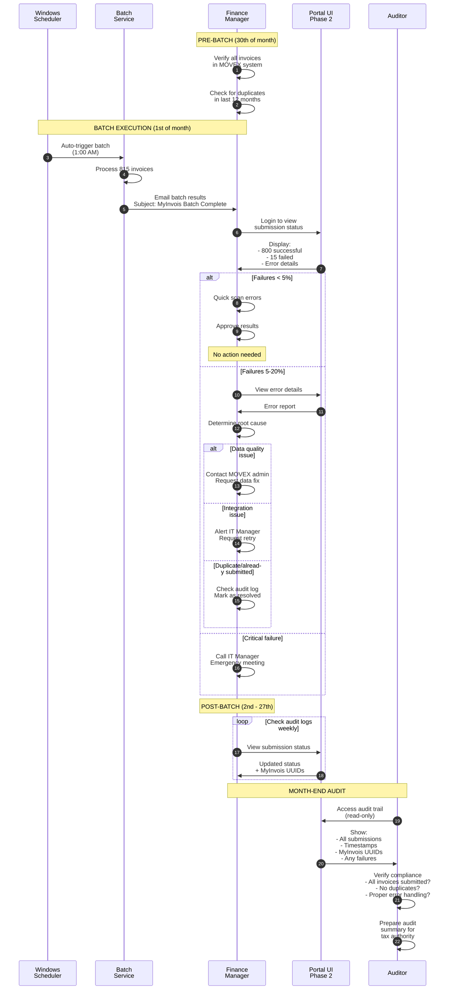

# Workflow Process - Finance Team Operations

**Last Updated:** February 18, 2026 (Updated with implementation progress)
**Status:** Production  
**Owner:** Finance Manager

## Purpose

This diagram shows the complete finance team workflow for monthly e-invoice submission, including:
- Pre-batch preparation
- Batch execution and monitoring
- Error handling and recovery
- Compliance and audit trail
- Post-batch reporting

## Monthly Submission Workflow



## Finance Team Approval Workflow



---

## Error Resolution Workflow

### Error Type 1: Duplicate Submission

```
Scenario: MyInvois says "Invoice DS302 - Already submitted"
  1. Finance manager sees error in report
  2. Opens Portal → Search invoice history
  3. Finds previous submission (Jan 15)
  4. Marks as "Duplicate - Skip"
  5. No action needed
  Resolution time: < 5 minutes
```

### Error Type 2: Missing Mandatory Field

```
Scenario: MyInvois rejects due to missing "Tax ID"
  1. Finance manager sees error (field: TaxId)
  2. Contacts MOVEX admin
  3. MOVEX admin updates invoice in M3
  4. Finance manager triggers retry on 2nd of month
  5. Batch re-processes and submits successfully
  Resolution time: 1-3 hours (depends on MOVEX admin)
```

### Error Type 3: Invalid Data Format

```
Scenario: MyInvois rejects "Invoice total doesn't match line items"
  1. Finance manager sees error (Detail: Total mismatch)
  2. Manually reviews invoice in MOVEX
  3. Finds data entry error
  4. Updates invoice in M3
  5. Finance manager retries via Portal UI
  6. Submission succeeds
  Resolution time: 30-60 minutes (manual review)
```

### Error Type 4: Service Error / Network Issue

```
Scenario: MyInvois returns "500 Server Error"
  1. Service automatically queues for retry (3 attempts)
  2. Finance manager sees "Pending" status
  3. System retries hourly for 3 times
  4. If still failed after 3 retries, escalate to IT
  5. IT investigates MyInvois API issue
  6. Once resolved, finance manager triggers batch retry
  Resolution time: 2-24 hours (depends on service availability)
```

---

## Compliance & Audit Trail

### Audit Trail Components
- ✅ **Who**: Service account executing batch
- ✅ **What**: 815 invoices submitted to MyInvois
- ✅ **When**: 2026-02-01 01:15 - 01:35 AM
- ✅ **Where**: MyInvois API endpoint
- ✅ **Why**: Monthly e-invoice filing requirement
- ✅ **How**: Automated batch with XAdES v1.1 signatures
- ✅ **Result**: 800 successful (UUID), 15 failed

### Audit Evidence Preserved
- Invoice source data (MOVEX export)
- Validation results (passed/failed)
- Transformation output (UBL 2.1 format)
- Submission requests & responses (MyInvois API)
- e-signature certificates (XAdES v1.1)
- Error reports & recovery actions
- All timestamps (UTC, ISO 8601)

### Retention Policy
- **Minimum 7 years** (Malaysian tax law requirement)
- Automatic archival after 1 year (cold storage, Phase 2)
- Immutable storage (SQL Server, append-only)
- Access logged for audit purposes

---

## Key Responsibilities

### Finance Manager
- Verify invoice completeness before batch (27th-31st)
- Review batch results (email notification)
- Approve/reject results
- Escalate critical issues
- Ensure compliance

### Finance Officer
- Monitor batch execution (if urgent)
- Fix data quality issues (contact MOVEX admin)
- Retry failed submissions (via Portal, Phase 2)
- Track submission status monthly

### MOVEX Administrator
- Provide invoice data to MOVEX system
- Respond to data quality issues
- Ensure timely data availability

### IT Manager
- Deploy and maintain MyInvois-Service
- Handle integration issues
- Manage credentials (Azure Key Vault)
- Escalate to MyInvois vendor if needed

### Auditor
- Review monthly submission compliance
- Verify audit trail integrity
- Prepare for tax authority audits
- Report on KPIs (success rate, timeliness)

---

## Success Criteria

### Per-Batch Success
- ✅ ≥95% of invoices submitted successfully
- ✅ All errors documented in audit trail
- ✅ Error report delivered within 1 hour
- ✅ Batch completes within 2-hour window
- ✅ Finance team can explain all failures

### Monthly Success
- ✅ 100% of invoices accounted for (submitted or escalated)
- ✅ Zero compliance violations
- ✅ All audit logs preserved
- ✅ No duplicate submissions to MyInvois
- ✅ Finance team satisfied with process

### Quarterly Success
- ✅ < 2% average failure rate
- ✅ < 30 minutes average batch time
- ✅ Zero unauthorized submissions
- ✅ Auditor approves audit trail

---

## Related Diagrams
- [architecture.md](architecture.md) - System components
- [integration-sequence.md](integration-sequence.md) - Batch processing details
- [data-flow.md](data-flow.md) - Invoice data movement
